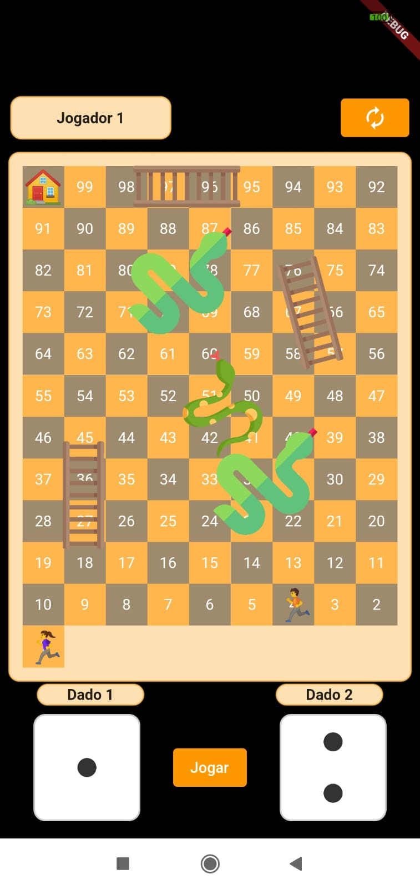
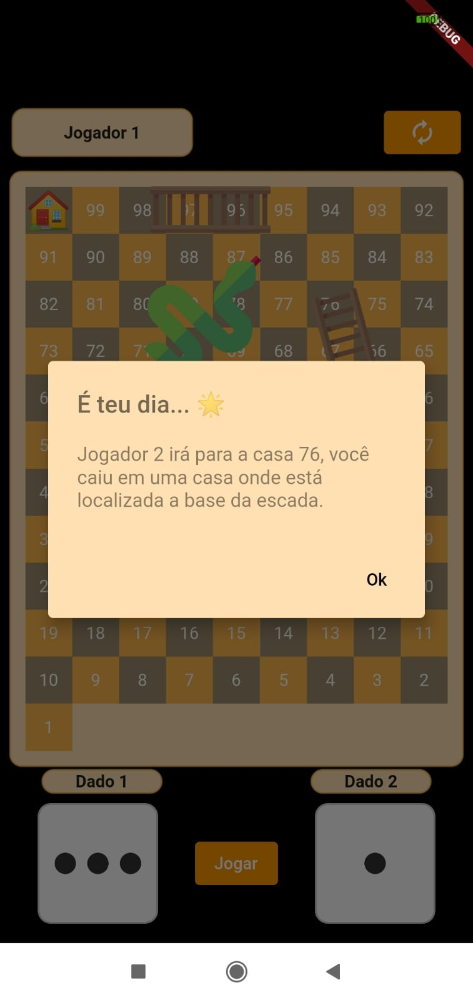
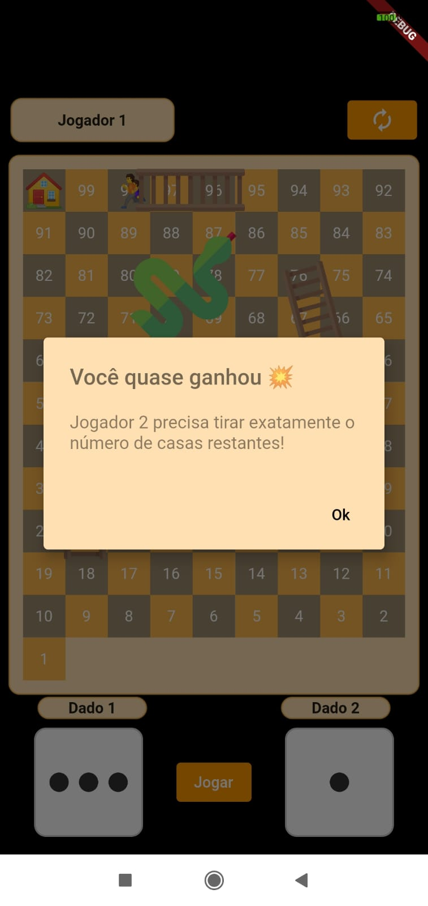
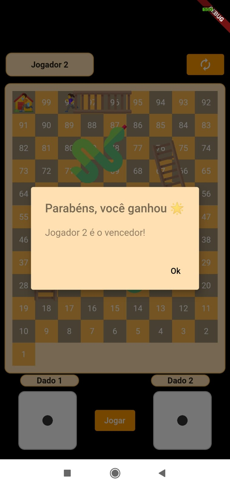

# Jogo indiano "Cobras e Escadas"

O jogo consta em que dois participantes tem o objetivo de chegar a casa número 100, durante o percurso caso ele chegue em uma casa em que está localizada a base da escada, ele pula para a casa em que está o topo da escada. Já caso ele chegue em uma casa que está localizada a cabeça da cobra, ele volta para a casa onde está o inicio da cobra. Caso o participante tire os dois dados nos valores iguais, ele ganha outra jogada. E no final, o participante só ganha se acertar exatamente o número de casas restantes.

## Executando o projeto
### :iphone: Mobile
* Execute no diretorio do projeto `flutter pub get`
* No VS Code abra `view > Command Palette > Flutter: Select Device`
* Selecione o seu smartphone/emulador
* Acesse `Run > Run Without Debugging`
* Permita instalar o app em seu smartphone/emulador

## Imagens do jogo  

